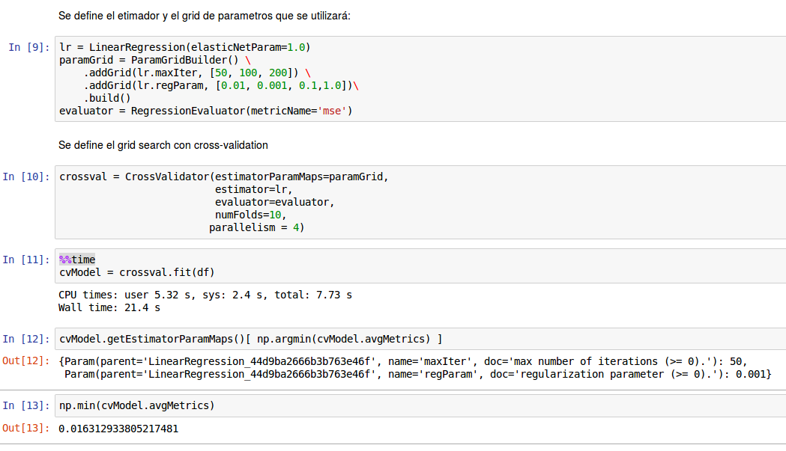

## Ejercicio/Tarea
### Daniel Sharp 138176

Aprovecha la capacidad de Dask para realizar cómputo en paralelo para ajustar un modelo para predecir la proporción de propina de un viaje. Realiza búsqueda de hiperparámetros en grid con cross validation. Puedes usar funciones de scikit learn. Recuerda usar el decorador `delayed` para ejecutar en paralelo.

* ¿Qué tan rápido es buscar en paralelo comparado con una búsqueda secuencial en python?

**Python**  
Necesitamos hacer one-hot-encoding para las variables categóricas (tipo de auto) y quizás convendría hacer 'feature engineering' para obtener otras variables, como mes del año, día de la semana o incluso periodo del día (madrugada, mañana, tarde, noche).


```python
from dask.distributed import Client
from dask import delayed
import dask.dataframe as dd
import pandas as pd
client = Client("scheduler:8786")
import time
```


```python
trips_df = dd.read_csv("/data/trips.csv")
trips_df.tpep_pickup_datetime = trips_df.tpep_pickup_datetime.astype('M8[us]')
trips_df.tpep_dropoff_datetime = trips_df.tpep_dropoff_datetime.astype('M8[us]')
trips_df.head()
```


<div>
<style scoped>
    .dataframe tbody tr th:only-of-type {
        vertical-align: middle;
    }

    .dataframe tbody tr th {
        vertical-align: top;
    }

    .dataframe thead th {
        text-align: right;
    }
</style>
<table border="1" class="dataframe">
  <thead>
    <tr style="text-align: right;">
      <th></th>
      <th>car_type</th>
      <th>fare_amount</th>
      <th>passenger_count</th>
      <th>taxi_id</th>
      <th>tip_amount</th>
      <th>tpep_dropoff_datetime</th>
      <th>tpep_pickup_datetime</th>
      <th>trip_distance</th>
    </tr>
  </thead>
  <tbody>
    <tr>
      <th>0</th>
      <td>A</td>
      <td>22.0</td>
      <td>1</td>
      <td>1</td>
      <td>4.60</td>
      <td>2015-01-03 01:37:02</td>
      <td>2015-01-03 01:17:32</td>
      <td>6.90</td>
    </tr>
    <tr>
      <th>1</th>
      <td>A</td>
      <td>9.0</td>
      <td>1</td>
      <td>1</td>
      <td>0.00</td>
      <td>2015-01-05 23:35:02</td>
      <td>2015-01-05 23:25:15</td>
      <td>1.81</td>
    </tr>
    <tr>
      <th>2</th>
      <td>A</td>
      <td>7.5</td>
      <td>1</td>
      <td>1</td>
      <td>1.00</td>
      <td>2015-01-06 15:22:12</td>
      <td>2015-01-06 15:11:45</td>
      <td>0.96</td>
    </tr>
    <tr>
      <th>3</th>
      <td>A</td>
      <td>8.5</td>
      <td>1</td>
      <td>1</td>
      <td>1.00</td>
      <td>2015-01-08 08:31:23</td>
      <td>2015-01-08 08:22:12</td>
      <td>1.90</td>
    </tr>
    <tr>
      <th>4</th>
      <td>A</td>
      <td>7.5</td>
      <td>1</td>
      <td>1</td>
      <td>1.66</td>
      <td>2015-01-08 12:35:54</td>
      <td>2015-01-08 12:26:26</td>
      <td>1.00</td>
    </tr>
  </tbody>
</table>
</div>


```python
from sklearn.base import TransformerMixin
```

Funciones para hacer feature engineering a los datos:


```python
# Extraer valor de timestamp
class getFromTimestamp(TransformerMixin):  

    def __init__(self, columns=[None], what = 'hour'):
        self.columns = columns
        self.what = what

    def transform(self, df):
        if (self.what is 'hour'):
            for col in self.columns:
                df["hour"] = df[col].map(lambda d: d.hour)
        elif (self.what is 'day'):
            for col in self.columns:
                df["day"]= df[col].map(lambda d: d.day)
        elif (self.what is 'dow'):
            for col in self.columns:
                df["dow"]= df[col].map(lambda d: d.dayofweek)
        elif (self.what is 'month'):
            for col in self.columns:
                df["month"]= df[col].map(lambda d: d.month)
        else:
            print("option not available")
        self = df
    def fit(self,*_):
        return self
```


```python
# Para particionar una variable de horas
class hourBuckets(TransformerMixin):  

    def __init__(self, column=None):
        self.column = column

    def transform(self, df):
        colname = self.column+"_buck"
        def func(x):
            if (x < 7):
                return 1
            elif(x < 13):
                return 2
            elif (x < 19):
                return 3
            else:
                return 4
        df[colname] = df[self.column].astype(int).map(lambda d: func(d))
        self = df
    def fit(self,*_):
        return self
```


```python
# Para particionar una variable de horas
class make_dummies(TransformerMixin):  

    def __init__(self, columns=[None]):
        self.columns = columns

    def transform(self, df):
        for c in self.columns:
            dummies = dd.get_dummies(df.categorize(columns=c)[c], prefix = c, drop_first=True)
            for col in dummies.columns:
                df[col] = dummies[col]
#        self = dd.get_dummies(df.categorize(self.columns), drop_first=True)
    def fit(self,*_):
        return self
```

Declaración de las funciones y ejecución para crear la base sobre la cual correré los modelos:


```python
h = getFromTimestamp(["tpep_dropoff_datetime"], "hour")
dow = getFromTimestamp(["tpep_dropoff_datetime"], "dow")
mon = getFromTimestamp(["tpep_dropoff_datetime"],"month")
hb = hourBuckets("hour")
md = make_dummies(['dow','hour_buck','month', 'car_type'])
```


```python
h.fit(trips_df).transform(trips_df)
dow.fit(trips_df).transform(trips_df)
mon.fit(trips_df).transform(trips_df)
hb.fit(trips_df).transform(trips_df)
md.fit(trips_df).transform(trips_df)
trips_df = trips_df.assign(target = trips_df.tip_amount/trips_df.fare_amount)
trips_df = trips_df.drop(['car_type','taxi_id','tpep_dropoff_datetime','tpep_pickup_datetime','hour','hour_buck','month','dow','tip_amount'],axis=1)
```


```python
trips_df.dtypes
```


    fare_amount        float64
    passenger_count      int64
    trip_distance      float64
    dow_0                uint8
    dow_1                uint8
    dow_3                uint8
    dow_4                uint8
    dow_6                uint8
    dow_2                uint8
    hour_buck_4          uint8
    hour_buck_3          uint8
    hour_buck_2          uint8
    car_type_B           uint8
    target             float64
    dtype: object


```python
trips_df[trips_df.isnull().any(axis=1)].compute()
```


<div>
<style scoped>
    .dataframe tbody tr th:only-of-type {
        vertical-align: middle;
    }

    .dataframe tbody tr th {
        vertical-align: top;
    }

    .dataframe thead th {
        text-align: right;
    }
</style>
<table border="1" class="dataframe">
  <thead>
    <tr style="text-align: right;">
      <th></th>
      <th>fare_amount</th>
      <th>passenger_count</th>
      <th>trip_distance</th>
      <th>dow_0</th>
      <th>dow_1</th>
      <th>dow_3</th>
      <th>dow_4</th>
      <th>dow_6</th>
      <th>dow_2</th>
      <th>hour_buck_4</th>
      <th>hour_buck_3</th>
      <th>hour_buck_2</th>
      <th>car_type_B</th>
      <th>target</th>
    </tr>
  </thead>
  <tbody>
    <tr>
      <th>3276</th>
      <td>0.0</td>
      <td>5</td>
      <td>0.23</td>
      <td>0</td>
      <td>1</td>
      <td>0</td>
      <td>0</td>
      <td>0</td>
      <td>0</td>
      <td>0</td>
      <td>0</td>
      <td>1</td>
      <td>0</td>
      <td>NaN</td>
    </tr>
    <tr>
      <th>4050</th>
      <td>0.0</td>
      <td>2</td>
      <td>13.40</td>
      <td>0</td>
      <td>0</td>
      <td>0</td>
      <td>0</td>
      <td>0</td>
      <td>0</td>
      <td>0</td>
      <td>0</td>
      <td>0</td>
      <td>1</td>
      <td>NaN</td>
    </tr>
    <tr>
      <th>5739</th>
      <td>0.0</td>
      <td>2</td>
      <td>4.80</td>
      <td>0</td>
      <td>0</td>
      <td>0</td>
      <td>0</td>
      <td>0</td>
      <td>1</td>
      <td>1</td>
      <td>0</td>
      <td>0</td>
      <td>1</td>
      <td>NaN</td>
    </tr>
  </tbody>
</table>
</div>


```python
# tiramos las tres observaciones con NA
trips_df = trips_df.dropna()
```

#### Hyper-parameters


```python
from sklearn.model_selection import GridSearchCV
from sklearn.linear_model import Lasso
from sklearn.model_selection import train_test_split
```


```python
params = {'max_iter' :[50, 100,200],
          'alpha':[0.001,0.01,0.1,1]}
```


```python
clf = GridSearchCV(Lasso(), params, cv=10, scoring='neg_mean_squared_error',verbose=1, n_jobs=-1)
delayed_clf = delayed(clf)
X = trips_df.drop('target',axis=1)
y = trips_df['target']
```


```python
%%time
res = delayed_clf.fit(X, y).compute()
```

    CPU times: user 20.9 ms, sys: 0 ns, total: 20.9 ms
    Wall time: 1.6 s


```python
res.grid_scores_
```

    /usr/local/lib/python3.5/site-packages/sklearn/model_selection/_search.py:761: DeprecationWarning: The grid_scores_ attribute was deprecated in version 0.18 in favor of the more elaborate cv_results_ attribute. The grid_scores_ attribute will not be available from 0.20
      DeprecationWarning)


    [mean: -0.01638, std: 0.00502, params: {'max_iter': 50, 'alpha': 0.001},
     mean: -0.01638, std: 0.00502, params: {'max_iter': 100, 'alpha': 0.001},
     mean: -0.01638, std: 0.00502, params: {'max_iter': 200, 'alpha': 0.001},
     mean: -0.01640, std: 0.00500, params: {'max_iter': 50, 'alpha': 0.01},
     mean: -0.01640, std: 0.00500, params: {'max_iter': 100, 'alpha': 0.01},
     mean: -0.01640, std: 0.00500, params: {'max_iter': 200, 'alpha': 0.01},
     mean: -0.01640, std: 0.00500, params: {'max_iter': 50, 'alpha': 0.1},
     mean: -0.01640, std: 0.00500, params: {'max_iter': 100, 'alpha': 0.1},
     mean: -0.01640, std: 0.00500, params: {'max_iter': 200, 'alpha': 0.1},
     mean: -0.01640, std: 0.00500, params: {'max_iter': 50, 'alpha': 1},
     mean: -0.01640, std: 0.00500, params: {'max_iter': 100, 'alpha': 1},
     mean: -0.01640, std: 0.00500, params: {'max_iter': 200, 'alpha': 1}]


```python
X = trips_df.drop('target',axis=1).compute()
y = trips_df['target'].compute()
```


```python
%%time
res = clf.fit(X,y)
```

    Fitting 10 folds for each of 12 candidates, totalling 120 fits
    CPU times: user 222 ms, sys: 92.6 ms, total: 314 ms
    Wall time: 1.92 s


    [Parallel(n_jobs=-1)]: Done 120 out of 120 | elapsed:    1.8s finished


```python
res.grid_scores_
```

    /usr/local/lib/python3.5/site-packages/sklearn/model_selection/_search.py:761: DeprecationWarning: The grid_scores_ attribute was deprecated in version 0.18 in favor of the more elaborate cv_results_ attribute. The grid_scores_ attribute will not be available from 0.20
      DeprecationWarning)


    [mean: -0.01638, std: 0.00502, params: {'max_iter': 50, 'alpha': 0.001},
     mean: -0.01638, std: 0.00502, params: {'max_iter': 100, 'alpha': 0.001},
     mean: -0.01638, std: 0.00502, params: {'max_iter': 200, 'alpha': 0.001},
     mean: -0.01640, std: 0.00500, params: {'max_iter': 50, 'alpha': 0.01},
     mean: -0.01640, std: 0.00500, params: {'max_iter': 100, 'alpha': 0.01},
     mean: -0.01640, std: 0.00500, params: {'max_iter': 200, 'alpha': 0.01},
     mean: -0.01640, std: 0.00500, params: {'max_iter': 50, 'alpha': 0.1},
     mean: -0.01640, std: 0.00500, params: {'max_iter': 100, 'alpha': 0.1},
     mean: -0.01640, std: 0.00500, params: {'max_iter': 200, 'alpha': 0.1},
     mean: -0.01640, std: 0.00500, params: {'max_iter': 50, 'alpha': 1},
     mean: -0.01640, std: 0.00500, params: {'max_iter': 100, 'alpha': 1},
     mean: -0.01640, std: 0.00500, params: {'max_iter': 200, 'alpha': 1}]


Haz lo mismo que arriba, pero utilizando la biblioteca Dask-ML http://dask-ml.readthedocs.io/en/latest/ 

* ¿Cómo se comparan los tiempos de ejecución de tu búsqueda con la de Dask ML?


```python
from dask_searchcv import GridSearchCV as GSCVDask
from dask_ml.linear_model import LinearRegression
```


```python
params = {'max_iter' :[50, 100,200],
          'C':[0.001,0.01,0.1,1]}
```

**Utilizando el estimador 'Linear Regression' y Grid Search de Dask**  
Por alguna razón es muy lento y tarda 3 minutos en ejecutarse:


```python
%%time
clf_dask = GSCVDask(LinearRegression(penalty='l1'), params, cv=10, scoring='neg_mean_squared_error', n_jobs=-1)
X = trips_df.drop('target',axis=1).values
y = trips_df['target'].values
res_dask=clf_dask.fit(X,y)
```

    CPU times: user 348 ms, sys: 29.5 ms, total: 378 ms
    Wall time: 4min 13s


```python
res_dask.best_score_
```


    -0.03341257110650153


**Utilizando el estimador 'Lasso' de Sklearn y Grid Search de Dask**  
Es mucho más rápido que el anterior y comparable con el de sklearn


```python
params = {'max_iter' :[50, 100,200],
          'alpha':[0.001,0.01,0.1,1]}
```


```python
%%time
#clf_dask = GSCVDask(LinearRegression(penalty='l1'), params, cv=10, scoring='neg_mean_squared_error', n_jobs=-1)
clf_dask = GSCVDask(Lasso(), params, cv=10, scoring='neg_mean_squared_error', n_jobs=-1)
X = trips_df.drop('target',axis=1).values
y = trips_df['target'].values
res_dask=clf_dask.fit(X,y)
```

    CPU times: user 49.7 ms, sys: 6.22 ms, total: 55.9 ms
    Wall time: 1.09 s


```python
res_dask.best_score_
```


    -0.016381782765348213


**Bonus**

Haz lo mismo utilizando Spark ML

* ¿Cómo se comparan los tiempos de ejecución de Spark vs Dask?

Guardo el dataframe procesado a CSV para poder ejecutarlo en Spark:


```python
dd.to_csv(trips_df,'/data/')
```


    ['/data/0.part']


La ejecución en Spark se encuentra en el archivo 'trips_spark.ipynb', a continuación está un screenshot de la ejecución del GridSearch en este programa:  



Del ejercicio podemos ver que el grid search más rápido fue utilizando la función de GridSearch de Dask con el estimador de Sklearn, tardó cerca de un segundo. El segundo más rápido fue el que utiliza las funciones de sklearn con el decorador de delayed, pues ejecutó el search completo tan solo 1.6 segundos, seguido por el grid utilizando funciones secuenciales de sklearn, con 1.9 segundos. Después está Spark, que tardó cerca de 20 segundos. Finalmente, y por mucho el más lento, fue la ejecución con el Grid Search de Dask y el estimador de Dask, que tardó poco más de 4 minutos. Esto fue sorprendente pues esperaba que fuera mucho más rápido.
